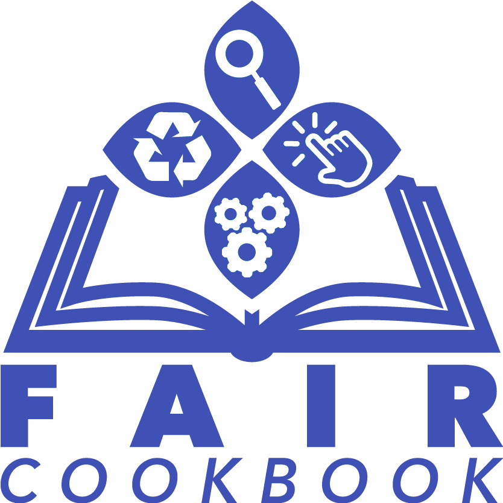

<!--  -->
<!--  -->

# The FAIR cookbook by the NIH-CFDE

The [Common Fund Data Ecosystem (CFDE)](https://nih-cfde.org) aims to assist the [Common Fund (CF)](https://commonfund.nih.gov/) Data Coordination Centers (DCC) with the process of making their digital objects that they host and produce better adhere to the [Findable, Accessible, Interoperable, and Reusable (FAIR) principles](https://www.nature.com/articles/sdata201618).

This FAIR cookbook provides introductory materials about various aspects of FAIRness, including practical guides that show how to enhance digital objects by adhering them to community accepted standards. This includes, for example, documenting and implementing tools with the [OpenAPI](https://swagger.io/docs/specification/about/) specification, structuring metadata in [DATS](https://www.nature.com/articles/sdata201759) format, providing [schema.org](https://schema.org/) specification on data and tool hosting websites, and converting datasets from DATS to [frictionless](https://frictionlessdata.io/specs/table-schema/) for CFDE ingestion.

CFDE FAIR cookbook recipes are provided with executable code and example data to guide DCCs through the various ways FAIRness improvements can be achieved. The cookbook is open source and encourages contributions from the community to improve its quality and enrich its depth and coverage.  

The cookbook also describes how to perform FAIR assessment of the digital objects hosted by each DCC with [FAIRshake](https://fairshake.cloud/). The vision is that FAIR scores will improve after the DCCs will follow the recipes to improve the FAIRness of their resources and this will be reflected in improved FAIR evaluation. 

