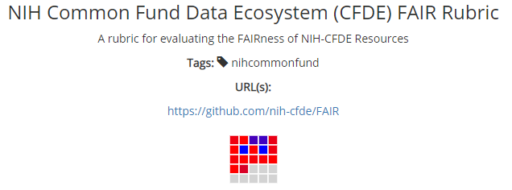

# Evaluating FAIRness with the CFDE rubric on FAIRshake

**Author(s)**: Steve Edwards, John Cheadle

**Maintainer(s)**: Steve Edwards, John Cheadle

**Version**: 1.0

**License**: GPLv2+

## FAIRshake Rubric for CFDE

All projects that are part of the Common Fund Data Ecosystem (CFDE) are evaluated using the CFDE FAIR Rubric, which is a set of 17 metrics that evaluate the Findability, Accessibility, Interoperability, and Reusability (FAIR) of each datasets across the different CF data coordination centers (DCCs). This Rubric is available via the [FAIRshake tool](https://fairshake.cloud/rubric/36/) and it is described in detail below. It should be noted that this Rubric is an initial draft and can be adjusted based on feedback and input from the DCCs.

 

## Understanding the FAIRshake Insignia

The FAIRshake insignia (pictured above) is a visual representation of a score given to a digital object based on a scoring rubric composed of metrics. It offers users a quick graphical view of the evaluation of the FAIR principles for that object. The number of colored boxes (non-gray) corresponds to the number of metrics in the rubric, whereas the color of the box indicates how well a metric adheres to FAIR principles (blue means full adherence and red not). Users can hover over the boxes to observe the score for each metric. The image below is from the [FAIRshake documentation page](https://fairshake.cloud/documentation/).

## FAIR Principles and Metrics Resources

The [original publication that described the FAIR principles](https://doi.org/10.25504/FAIRsharing.WWI10U) lays out very abstractly what it means to be FAIR.  Later on, the same group that published the popular FAIR guidelines paper developed the concept of FAIR metrics and [authored a publication about them](https://doi.org/10.5281/zenodo.1065973).

FAIRshake was then developed to host FAIR evaluations. FAIRshake allows using other metrics besides those that were published in the FAIR metrics paper. A publication that describes the FAIRshake can be found on the [fairsharing.org](https://doi.org/10.1016/j.cels.2019.09.011) site. 

### Globally Unique Identifiers

Provide a URL to a registered scheme that defines the globally-unique structure of the identifier(s) for your digital resource. Examples of identifier schemes are available on the [fairsharing.org](https://fairsharing.org/standards/?q=&selected_facets=type_exact:identifier%20schema) site.

**Principle**: F1

**Metric(s)**: FM-F1A

**Rationale**: The uniqueness of an identifier is a necessary condition to unambiguously refer to a resource, and that resource alone. Otherwise, an identifier shared by multiple resources will confound efforts to describe that resource, or to use the identifier to retrieve it.

**URL(s):**
* [https://github.com/FAIRMetrics/Metrics/blob/master/Distributions/FM_F1A.pdf](https://github.com/FAIRMetrics/Metrics/blob/master/Distributions/FM_F1A.pdf) 
* [https://purl.org/fair-metrics/FM_F1A](https://purl.org/fair-metrics/FM_F1A)
* [https://doi.org/10.25504/FAIRsharing.r49beq](https://doi.org/10.25504/FAIRsharing.r49beq)

### Machine-Readable Metadata

Provide the URL to a document that contains machine-readable metadata for the digital resource.

**Principle**: F2

**Metric(s)**: FM-F2

**Rationale**: Metadata plays an important role in enabling users to find a resource of interest. Metadata may be indexed to facilitate keyword searches over structured and unstructured metadata. However, only with structured metadata can an indexing system provide increased precision of combining keyword searches with restrictions on particular attributes, e.g., license, or standards used.

**URL(s):**

* [https://github.com/FAIRMetrics/Metrics/blob/master/Distributions/FM_F2.pdf](https://github.com/FAIRMetrics/Metrics/blob/master/Distributions/FM_F2.pdf)
* [https://purl.org/fair-metrics/FM_F2](https://purl.org/fair-metrics/FM_F2)
* [https://doi.org/10.25504/FAIRsharing.ztr3n9](https://doi.org/10.25504/FAIRsharing.ztr3n9)

### Standardized Metadata

The URI of a registered metadata format in FAIRSharing (for example, https://fairsharing.org/FAIRsharing.tn873z if your data follows the INSD Sequence XML format)

**Principle**: F4

**Metric(s)**: FM-F4, FM-R1.3

**Rationale**: Having a structured metadata document is a great first step, but it should also follow a known community standard to reduce the work needed to index that metadata by search engines.

**URL(s):**
* [https://github.com/FAIRMetrics/Metrics/blob/master/Distributions/FM_F4.pdf](https://github.com/FAIRMetrics/Metrics/blob/master/Distributions/FM_F4.pdf)
* [https://purl.org/fair-metrics/FM_F4](https://purl.org/fair-metrics/FM_F4)
* [https://doi.org/10.25504/FAIRsharing.Lcws1N](https://doi.org/10.25504/FAIRsharing.Lcws1N)
* [https://github.com/FAIRMetrics/Metrics/blob/master/Distributions/FM_R1.3.pdf](https://github.com/FAIRMetrics/Metrics/blob/master/Distributions/FM_R1.3.pdf) 
* [https://purl.org/fair-metrics/FM_R1.3](https://purl.org/fair-metrics/FM_R1.3)
* [https://doi.org/10.25504/FAIRsharing.cuyPH9](https://doi.org/10.25504/FAIRsharing.cuyPH9)

### Resource Identifier in Metadata

The identifier that should explicitly appear in the metadata.

**Principle**: F3

**Metric(s)**: FM-F3

**Rationale**: Metadata are intended to provide information about a digital resource. However, data and their metadata are created and published separated (they are in different files and in different formats). Since F1 specifies that metadata and data must have different identifiers, it is important that metadata contain the resource identifier, so that the resource can be exactly accessed by its identifier (A1).

**URL(s):**

* [https://github.com/FAIRMetrics/Metrics/blob/master/Distributions/FM_F3.pdf](https://github.com/FAIRMetrics/Metrics/blob/master/Distributions/FM_F3.pdf) 
* [https://purl.org/fair-metrics/FM_F3](https://purl.org/fair-metrics/FM_F3)
* [https://fairsharing.org/FAIRsharing.o8TYnW](https://fairsharing.org/FAIRsharing.o8TYnW)

### NIH Program Name is Available for Querying

This confirms that the data resource includes the name of the CF program under which the work was performed.

**Principle**: F2

**Metric(s)**: FM-F2, FM-R1.2

**Rationale**: There are many examples where a user may want to see all data that resulted from a specific NIH CF program.

**URL(s):**

* [https://github.com/FAIRMetrics/Metrics/blob/master/Distributions/FM_F2.pdf](https://github.com/FAIRMetrics/Metrics/blob/master/Distributions/FM_F2.pdf)
* [https://purl.org/fair-metrics/FM_F2](https://purl.org/fair-metrics/FM_F2)
* [https://doi.org/10.25504/FAIRsharing.ztr3n9](https://doi.org/10.25504/FAIRsharing.ztr3n9)
* [https://github.com/FAIRMetrics/Metrics/blob/master/Distributions/FM_R1.2.pdf](https://github.com/FAIRMetrics/Metrics/blob/master/Distributions/FM_R1.2.pdf)
* [https://purl.org/fair-metrics/FM_R1.2](https://purl.org/fair-metrics/FM_R1.2)
* [https://doi.org/10.25504/FAIRsharing.qcziIV](https://doi.org/10.25504/FAIRsharing.qcziIV)

### NIH Project Name is Available for Querying

This confirms that the data resource includes the name of the NIH project that collected the data.

**Principle**: F2

**Metric(s)**: FM-F2, FM-R1.2

**Rationale** A user may want to find all the data from a specific project when analyzing the data of interest. This could be for discovery purposes or to identify confounding variables within the data.

**URL(s):**

* [https://github.com/FAIRMetrics/Metrics/blob/master/Distributions/FM_F2.pdf](https://github.com/FAIRMetrics/Metrics/blob/master/Distributions/FM_F2.pdf)
* [https://purl.org/fair-metrics/FM_F2](https://purl.org/fair-metrics/FM_F2)
* [https://doi.org/10.25504/FAIRsharing.ztr3n9](https://doi.org/10.25504/FAIRsharing.ztr3n9)
* [https://github.com/FAIRMetrics/Metrics/blob/master/Distributions/FM_R1.2.pdf](https://github.com/FAIRMetrics/Metrics/blob/master/Distributions/FM_R1.2.pdf)
* [https://purl.org/fair-metrics/FM_R1.2](https://purl.org/fair-metrics/FM_R1.2)
* [https://doi.org/10.25504/FAIRsharing.qcziIV](https://doi.org/10.25504/FAIRsharing.qcziIV)

### The Institution that Created this Dataset is Available

This confirms that the identity of the institution where the dataset was created is available within the metadata for the dataset.

**Principle**: F2

**Metric(s)**: FM-F2, FM-R1.2

**Rationale**: This information can be used to find additional datasets by the creators of this dataset as well as for citation purposes when reusing the data.

**URL(s):**

* [https://github.com/FAIRMetrics/Metrics/blob/master/Distributions/FM_F2.pdf](https://github.com/FAIRMetrics/Metrics/blob/master/Distributions/FM_F2.pdf)
* [https://purl.org/fair-metrics/FM_F2](https://purl.org/fair-metrics/FM_F2)
* [https://doi.org/10.25504/FAIRsharing.ztr3n9](https://doi.org/10.25504/FAIRsharing.ztr3n9)
* [https://github.com/FAIRMetrics/Metrics/blob/master/Distributions/FM_R1.2.pdf](https://github.com/FAIRMetrics/Metrics/blob/master/Distributions/FM_R1.2.pdf)
* [https://purl.org/fair-metrics/FM_R1.2](https://purl.org/fair-metrics/FM_R1.2)
* [https://doi.org/10.25504/FAIRsharing.qcziIV](https://doi.org/10.25504/FAIRsharing.qcziIV)

### A Landing Page Exists and is Accessible

This confirms that the resource containing the dataset has a main page with information about the resource.

**Principle**: F

**Metric(s)**: FM-F4, FM-A1.1

**Rationale**: For users to determine if the data in the resource is suitable for their purposes, a central website with information about the resource and links to the data is important.

**URL(s):**

* [https://github.com/FAIRMetrics/Metrics/blob/master/Distributions/FM_F4.pdf](https://github.com/FAIRMetrics/Metrics/blob/master/Distributions/FM_F4.pdf)
* [https://purl.org/fair-metrics/FM_F4](https://purl.org/fair-metrics/FM_F4)
* [https://doi.org/10.25504/FAIRsharing.Lcws1N](https://doi.org/10.25504/FAIRsharing.Lcws1N)
* [https://github.com/FAIRMetrics/Metrics/blob/master/Distributions/FM_A1.1.pdf](https://github.com/FAIRMetrics/Metrics/blob/master/Distributions/FM_A1.1.pdf)
* [https://purl.org/fair-metrics/FM_A1.1](https://purl.org/fair-metrics/FM_A1.1)
* [https://fairsharing.org/FAIRsharing.yDJci5](https://fairsharing.org/FAIRsharing.yDJci5)

### Open, Free, Standardized Access Protocol

Provide a URL to the access protocol.

**Principle**: A1.1

**Metric(s)**: FM-A1.1

**Rationale**: Digital resources and their metadata should be retrievable through standardised communication protocols. Open, free, and standardised communication protocols reduce the cost and effort for any part to gain authorized access to a digital resource. Having a protocol that is open allows any individual to create their own standard-compliant implementation, that it is free reduces the possibility that those lacking monetary means cannot access the resource, and that it is universally implementable ensures that such technology is available to all (and not restricted, for instance by country or creed). The resource should be accessible through an open, free, and standardized communication protocol. 

**URL(s):**

* [https://github.com/FAIRMetrics/Metrics/blob/master/Distributions/FM_A1.1.pdf](https://github.com/FAIRMetrics/Metrics/blob/master/Distributions/FM_A1.1.pdf)
* [https://purl.org/fair-metrics/FM_A1.1](https://purl.org/fair-metrics/FM_A1.1)
* [https://fairsharing.org/FAIRsharing.yDJci5](https://fairsharing.org/FAIRsharing.yDJci5)

### A Biological Assay is Present and Resolvable in the BioAssay Ontology

Confirm that biological assays are described using a formal ontology.

**Principle**: I

**Metric(s)**: FM-I1, FM-I2, FM-I3

**Rationale**: Interoperability requires 1: (Meta)data use a formal, accessible, shared, and broadly applicable language for knowledge representation; 2: (Meta)data use vocabularies that follow the FAIR principles; 3: (Meta)data include qualified references to other (meta)data. This ontology meets all of those criteria.

**URL(s):**

* [https://www.ebi.ac.uk/ols/ontologies/bao](https://www.ebi.ac.uk/ols/ontologies/bao)
* [https://github.com/FAIRMetrics/Metrics/blob/master/Distributions/FM_I1.pdf](https://github.com/FAIRMetrics/Metrics/blob/master/Distributions/FM_I1.pdf)
* [https://purl.org/fair-metrics/FM_I1](https://purl.org/fair-metrics/FM_I1)
* [https://doi.org/10.25504/FAIRsharing.jLpL6i](https://doi.org/10.25504/FAIRsharing.jLpL6i)
* [https://github.com/FAIRMetrics/Metrics/blob/master/Distributions/FM_I2.pdf](https://github.com/FAIRMetrics/Metrics/blob/master/Distributions/FM_I2.pdf)
* [https://purl.org/fair-metrics/FM_I2](https://purl.org/fair-metrics/FM_I2)
* [https://doi.org/10.25504/FAIRsharing.0A9kNV](https://doi.org/10.25504/FAIRsharing.0A9kNV)
* [https://github.com/FAIRMetrics/Metrics/blob/master/Distributions/FM_I3.pdf](https://github.com/FAIRMetrics/Metrics/blob/master/Distributions/FM_I3.pdf)
* [https://purl.org/fair-metrics/FM_I3](https://purl.org/fair-metrics/FM_I3)
* [https://doi.org/10.25504/FAIRsharing.B2sbNh](https://doi.org/10.25504/FAIRsharing.B2sbNh)

### A Relevant Anatomical Part is Present and Resolvable in the UBERON Ontology

Confirms that references to anatomical structures use a formal ontology.

**Principle**: I

**Metric(s)**: FM-I1, FM-I2, FM-I3

**Rationale**: Interoperability requires 1: (Meta)data use a formal, accessible, shared, and broadly applicable language for knowledge representation; 2: (Meta)data use vocabularies that follow the FAIR principles; 3: (Meta)data include qualified references to other (meta)data. This ontology meets all of those criteria.

**URL(s):**

* [https://www.ebi.ac.uk/ols/ontologies/uberon](https://www.ebi.ac.uk/ols/ontologies/uberon)
* [https://github.com/FAIRMetrics/Metrics/blob/master/Distributions/FM_I1.pdf](https://github.com/FAIRMetrics/Metrics/blob/master/Distributions/FM_I1.pdf)
* [https://purl.org/fair-metrics/FM_I1](https://purl.org/fair-metrics/FM_I1)
* [https://doi.org/10.25504/FAIRsharing.jLpL6i](https://doi.org/10.25504/FAIRsharing.jLpL6i)
* [https://github.com/FAIRMetrics/Metrics/blob/master/Distributions/FM_I2.pdf](https://github.com/FAIRMetrics/Metrics/blob/master/Distributions/FM_I2.pdf)
* [https://purl.org/fair-metrics/FM_I2](https://purl.org/fair-metrics/FM_I2)
* [https://doi.org/10.25504/FAIRsharing.0A9kNV](https://doi.org/10.25504/FAIRsharing.0A9kNV)
* [https://github.com/FAIRMetrics/Metrics/blob/master/Distributions/FM_I3.pdf](https://github.com/FAIRMetrics/Metrics/blob/master/Distributions/FM_I3.pdf)
* [https://purl.org/fair-metrics/FM_I3](https://purl.org/fair-metrics/FM_I3)
* [https://doi.org/10.25504/FAIRsharing.B2sbNh](https://doi.org/10.25504/FAIRsharing.B2sbNh)

### A Relevant Disease is Present and Resolvable in the MONDO Ontology

Confirms that references to diseases use a formal ontology.

**Principle**: I

**Metric(s)**: FM-I1, FM-I2, FM-I3

**Rationale**: Interoperability requires 1: (Meta)data use a formal, accessible, shared, and broadly applicable language for knowledge representation; 2: (Meta)data use vocabularies that follow the FAIR principles; 3: (Meta)data include qualified references to other (meta)data. This ontology meets all of those criteria.

**URL(s):**

* [https://www.ebi.ac.uk/ols/ontologies/mondo](https://www.ebi.ac.uk/ols/ontologies/mondo)
* [https://github.com/FAIRMetrics/Metrics/blob/master/Distributions/FM_I1.pdf](https://github.com/FAIRMetrics/Metrics/blob/master/Distributions/FM_I1.pdf)
* [https://purl.org/fair-metrics/FM_I1](https://purl.org/fair-metrics/FM_I1)
* [https://doi.org/10.25504/FAIRsharing.jLpL6i](https://doi.org/10.25504/FAIRsharing.jLpL6i)
* [https://github.com/FAIRMetrics/Metrics/blob/master/Distributions/FM_I2.pdf](https://github.com/FAIRMetrics/Metrics/blob/master/Distributions/FM_I2.pdf)
* [https://purl.org/fair-metrics/FM_I2](https://purl.org/fair-metrics/FM_I2)
* [https://doi.org/10.25504/FAIRsharing.0A9kNV](https://doi.org/10.25504/FAIRsharing.0A9kNV)
* [https://github.com/FAIRMetrics/Metrics/blob/master/Distributions/FM_I3.pdf](https://github.com/FAIRMetrics/Metrics/blob/master/Distributions/FM_I3.pdf)
* [https://purl.org/fair-metrics/FM_I3](https://purl.org/fair-metrics/FM_I3)
* [https://doi.org/10.25504/FAIRsharing.B2sbNh](https://doi.org/10.25504/FAIRsharing.B2sbNh)

### A Relevant File Type is Present and Resolvable in the EDAM Ontology

Confirms that the file types in the dataset are described using a formal ontology.

**Principle**: I

**Metric(s)**: FM-I1, FM-I2, FM-I3

**Rationale**: Interoperability requires 1: (Meta)data use a formal, accessible, shared, and broadly applicable language for knowledge representation; 2: (Meta)data use vocabularies that follow the FAIR principles; 3: (Meta)data include qualified references to other (meta)data. This ontology meets all of those criteria.

**URL(s):**

* [https://www.ebi.ac.uk/ols/ontologies/edam](https://www.ebi.ac.uk/ols/ontologies/edam)
* [https://github.com/FAIRMetrics/Metrics/blob/master/Distributions/FM_I1.pdf](https://github.com/FAIRMetrics/Metrics/blob/master/Distributions/FM_I1.pdf)
* [https://purl.org/fair-metrics/FM_I1](https://purl.org/fair-metrics/FM_I1)
* [https://doi.org/10.25504/FAIRsharing.jLpL6i](https://doi.org/10.25504/FAIRsharing.jLpL6i)
* [https://github.com/FAIRMetrics/Metrics/blob/master/Distributions/FM_I2.pdf](https://github.com/FAIRMetrics/Metrics/blob/master/Distributions/FM_I2.pdf)
* [https://purl.org/fair-metrics/FM_I2](https://purl.org/fair-metrics/FM_I2)
* [https://doi.org/10.25504/FAIRsharing.0A9kNV](https://doi.org/10.25504/FAIRsharing.0A9kNV)
* [https://github.com/FAIRMetrics/Metrics/blob/master/Distributions/FM_I3.pdf](https://github.com/FAIRMetrics/Metrics/blob/master/Distributions/FM_I3.pdf)
* [https://purl.org/fair-metrics/FM_I3](https://purl.org/fair-metrics/FM_I3)
* [https://doi.org/10.25504/FAIRsharing.B2sbNh](https://doi.org/10.25504/FAIRsharing.B2sbNh)

### A Relevant Taxonomy is Present and Resolvable in the NCBITaxon Ontology

Confirms that references to the species from which data where collected are described using a formal ontology.

**Principle**: F

**Metric(s)**: FM-I1, FM-I2, FM-I3

**Rationale**: Interoperability requires 1: (Meta)data use a formal, accessible, shared, and broadly applicable language for knowledge representation; 2: (Meta)data use vocabularies that follow the FAIR principles; 3: (Meta)data include qualified references to other (meta)data. This ontology meets all of those criteria.

**URL(s):**

* [https://www.ebi.ac.uk/ols/ontologies/NCBITaxon](https://www.ebi.ac.uk/ols/ontologies/NCBITaxon)
* [https://github.com/FAIRMetrics/Metrics/blob/master/Distributions/FM_I1.pdf](https://github.com/FAIRMetrics/Metrics/blob/master/Distributions/FM_I1.pdf)
* [https://purl.org/fair-metrics/FM_I1](https://purl.org/fair-metrics/FM_I1)
* [https://doi.org/10.25504/FAIRsharing.jLpL6i](https://doi.org/10.25504/FAIRsharing.jLpL6i)
* [https://github.com/FAIRMetrics/Metrics/blob/master/Distributions/FM_I2.pdf](https://github.com/FAIRMetrics/Metrics/blob/master/Distributions/FM_I2.pdf)
* [https://purl.org/fair-metrics/FM_I2](https://purl.org/fair-metrics/FM_I2)
* [https://doi.org/10.25504/FAIRsharing.0A9kNV](https://doi.org/10.25504/FAIRsharing.0A9kNV)
* [https://github.com/FAIRMetrics/Metrics/blob/master/Distributions/FM_I3.pdf](https://github.com/FAIRMetrics/Metrics/blob/master/Distributions/FM_I3.pdf)
* [https://purl.org/fair-metrics/FM_I3](https://purl.org/fair-metrics/FM_I3)
* [https://doi.org/10.25504/FAIRsharing.B2sbNh](https://doi.org/10.25504/FAIRsharing.B2sbNh)

### A Relevant Cell Line is Present and Resolvable in the Cellosaurus Ontology

Confirms that cell lines, for experiments performed on immortalized cell lines, are described using a formal ontology.

**Principle**: I

**Metric(s)**: FM-I1, FM-I2, FM-I3

**Rationale**: Interoperability requires 1: (Meta)data use a formal, accessible, shared, and broadly applicable language for knowledge representation; 2: (Meta)data use vocabularies that follow the FAIR principles; 3: (Meta)data include qualified references to other (meta)data. This ontology meets all of those criteria.

**URL(s):**

* [https://web.expasy.org/cellosaurus/](https://web.expasy.org/cellosaurus/)
* [https://github.com/FAIRMetrics/Metrics/blob/master/Distributions/FM_I1.pdf](https://github.com/FAIRMetrics/Metrics/blob/master/Distributions/FM_I1.pdf)
* [https://purl.org/fair-metrics/FM_I1](https://purl.org/fair-metrics/FM_I1)
* [https://doi.org/10.25504/FAIRsharing.jLpL6i](https://doi.org/10.25504/FAIRsharing.jLpL6i)
* [https://github.com/FAIRMetrics/Metrics/blob/master/Distributions/FM_I2.pdf](https://github.com/FAIRMetrics/Metrics/blob/master/Distributions/FM_I2.pdf)
* [https://purl.org/fair-metrics/FM_I2](https://purl.org/fair-metrics/FM_I2)
* [https://doi.org/10.25504/FAIRsharing.0A9kNV](https://doi.org/10.25504/FAIRsharing.0A9kNV)
* [https://github.com/FAIRMetrics/Metrics/blob/master/Distributions/FM_I3.pdf](https://github.com/FAIRMetrics/Metrics/blob/master/Distributions/FM_I3.pdf)
* [https://purl.org/fair-metrics/FM_I3](https://purl.org/fair-metrics/FM_I3)
* [https://doi.org/10.25504/FAIRsharing.B2sbNh](https://doi.org/10.25504/FAIRsharing.B2sbNh)

### Contact Information is Provided for the Creator(s) of the Dataset.

Contact information (typically name and email address)  for the creator(s) of the dataset.

**Principle**: R

**Metric(s)**: FM-R1.2

**Rationale**: It is important to identify the creators of the data set as part of defining provenance of the data (who/what/when produced the data).  This informs users of who should get credit if this dataset is used in other contexts.

**URL(s):**

* [https://github.com/FAIRMetrics/Metrics/blob/master/Distributions/FM_R1.2.pdf](https://github.com/FAIRMetrics/Metrics/blob/master/Distributions/FM_R1.2.pdf)
* [https://purl.org/fair-metrics/FM_R1.2](https://purl.org/fair-metrics/FM_R1.2)
* [https://doi.org/10.25504/FAIRsharing.qcziIV](https://doi.org/10.25504/FAIRsharing.qcziIV)

### Digital Resource License

Provide a URL to the license that governs the use of the digital resource.

**Principle**: R

**Metric(s)**: FM-R1.1

**Rationale**: Both digital resources and their metadata must be licensed (or equivalent e.g. terms of use, smart contract). The lack of a license indicates that no rights to reuse are granted, thereby deterring lawful use. Note that the combination of resources with restrictive license conditions may lead to adverse effects, and ultimately preclude their combined use. To satisfy this, two URLs must be provided -> one for the metadata and one for the digital resource.

**URL(s):**

* [https://github.com/FAIRMetrics/Metrics/blob/master/Distributions/FM_R1.1.pdf](https://github.com/FAIRMetrics/Metrics/blob/master/Distributions/FM_R1.1.pdf)
* [https://purl.org/fair-metrics/FM_R1.1](https://purl.org/fair-metrics/FM_R1.1)
* [https://doi.org/10.25504/FAIRsharing.fsB7NK](https://doi.org/10.25504/FAIRsharing.fsB7NK)

### Metadata License

Provide a URL to the license that governs the use of the digital resource.

**Principle**: R

**Metric(s)**: FM-R1.1

**Rationale**: Both digital resources and their metadata must be licensed (or equivalent e.g. terms of use, smart contract). The lack of a license indicates that no rights to reuse are granted, thereby deterring lawful use. Note that the combination of resources with restrictive license conditions may lead to adverse effects, and ultimately preclude their combined use.

**URL(s):**

* [https://github.com/FAIRMetrics/Metrics/blob/master/Distributions/FM_R1.1.pdf](https://github.com/FAIRMetrics/Metrics/blob/master/Distributions/FM_R1.1.pdf)
* [https://purl.org/fair-metrics/FM_R1.1](https://purl.org/fair-metrics/FM_R1.1)
* [https://doi.org/10.25504/FAIRsharing.fsB7NK](https://doi.org/10.25504/FAIRsharing.fsB7NK)

## Rubric Metrics Summary Table

<table>
  <tr>
  <td><b>Rubric Metric Names</b></td>
    <td><b>FAIR principle(s)</b></td>
    <td><b>Relevant FAIR Metric(s)</b></td>
    <td><b>Human-readable PURL</b></td>
    <td><b>Machine-readable PURL</b></td>
  </tr>
  <tr>
    <td>Globally Unique Identifiers</td>
    <td>F1</td>
    <td>Identifier Uniqueness(FM-F1A)</td>
    <td><a href="https://doi.org/10.25504/FAIRsharing.r49beq">https://doi.org/10.25504/FAIRsharing.r49beq</a>
 </td>
 <td><a href="https://purl.org/fair-metrics/FM_F1A">https://purl.org/fair-metrics/FM_F1A</a></td>
  </tr>
  <tr>
    <td>Machine-readable Metadata</td>
    <td>F2</td>
    <td>Machine-readability of metadata (FM-F2)</td>
    <td><a href="https://doi.org/10.25504/FAIRsharing.ztr3n9">https://doi.org/10.25504/FAIRsharing.ztr3n9</a></td>
    <td><a href="https://purl.org/fair-metrics/FM_F2">https://purl.org/fair-metrics/FM_F2</a></td>
  </tr>
  <tr>
    <td>Standardized Metadata</td>
    <td>F4, R1.3</td>
    <td>Indexed in a searchable resource (FM-F4); Meets Community Standards (FM-R1.3)
 </td>
 <td><a href="https://doi.org/10.25504/FAIRsharing.Lcws1N">https://doi.org/10.25504/FAIRsharing.Lcws1N</a>;
 
 <a href="https://doi.org/10.25504/FAIRsharing.cuyPH9">https://doi.org/10.25504/FAIRsharing.cuyPH9</a></td>
 <td><a href="https://purl.org/fair-metrics/FM_F4">https://purl.org/fair-metrics/FM_F4</a>;
 
 <a href="https://purl.org/fair-metrics/FM_R1.3">https://purl.org/fair-metrics/FM_R1.3</a></td>
  </tr>
  <tr>
    <td>Resource Identifier in Metadata</td>
    <td>F3</td>
    <td>Resource Identifier in Metadata (FM-F3)</td>
    <td><a href="https://doi.org/10.25504/FAIRsharing.o8TYnW">https://doi.org/10.25504/FAIRsharing.o8TYnW</a></td>
    <td><a href="https://purl.org/fair-metrics/FM_F3">https://purl.org/fair-metrics/FM_F3</a></td>
  </tr>
  <tr>
    <td>NIH Program Name is Available for Querying</td>
    <td>F2,R1.2</td>
    <td>Machine-readability of metadata (FM-F2);
    Detailed Provenance (FM-R1.2)</td>
    <td><a href="https://doi.org/10.25504/FAIRsharing.ztr3n9">https://doi.org/10.25504/FAIRsharing.ztr3n9</a>;
    <a href="https://doi.org/10.25504/FAIRsharing.qcziIV">https://doi.org/10.25504/FAIRsharing.qcziIV</a></td>
    <td><a href="https://purl.org/fair-metrics/FM_F2">https://purl.org/fair-metrics/FM_F2</a>;
    <a 
    href="https://purl.org/fair-metrics/FM_R1.2">https://purl.org/fair-metrics/FM_R1.2</a></td>
  </tr>
  <tr>
    <td>NIH Project Name is Available for Querying</td>
    <td>F2,R1.2</td>
    <td>Machine-readability of metadata (FM-F2); Detailed Provenance (FM-R1.2)</td>
    <td><a href="https://doi.org/10.25504/FAIRsharing.ztr3n9">https://doi.org/10.25504/FAIRsharing.ztr3n9</a>; <a href="https://doi.org/10.25504/FAIRsharing.qcziIV">https://doi.org/10.25504/FAIRsharing.qcziIV</a></td>
    <td><a href="https://purl.org/fair-metrics/FM_F2">https://purl.org/fair-metrics/FM_F2</a>; <a href="https://purl.org/fair-metrics/FM_R1.2">https://purl.org/fair-metrics/FM_R1.2</a></td>
  </tr>
  <tr>
    <td>The Institution that Created this Dataset is Available (for Querying?)</td>
    <td>(F2),R1.2</td>
    <td>Machine-readability of metadata (FM-F2); Detailed Provenance (FM-R1.2)</td>
    <td><a href="https://doi.org/10.25504/FAIRsharing.ztr3n9">https://doi.org/10.25504/FAIRsharing.ztr3n9</a>; <a href="https://doi.org/10.25504/FAIRsharing.qcziIV">https://doi.org/10.25504/FAIRsharing.qcziIV</a></td>
    <td><a href="https://purl.org/fair-metrics/FM_F2">https://purl.org/fair-metrics/FM_F2</a>; <a href="https://purl.org/fair-metrics/FM_R1.2">https://purl.org/fair-metrics/FM_R1.2</a></td>
  </tr>
  <tr>
    <td>A Landing Page Exists and is Accessible</td>
    <td>(F4),A1</td>
    <td>Access Protocol (FM-A1.1)</td>
    <td><a href="https://doi.org/10.25504/FAIRsharing.yDJci5">https://doi.org/10.25504/FAIRsharing.yDJci5</a></td>
    <td>

<a href="https://raw.githubusercontent.com/FAIRMetrics/Metrics/master/FM_A1.1">https://raw.githubusercontent.com/FAIRMetrics/Metrics/master/FM_A1.1</a></td>
  </tr>
  <tr>
    <td>Open, Free, Standardized Access Protocol</td>
    <td>A1</td>
    <td>Access Protocol (FM-A1.1)</td>
    <td><a href="https://doi.org/10.25504/FAIRsharing.yDJci5">https://doi.org/10.25504/FAIRsharing.yDJci5</a></td>
    <td><a href="https://raw.githubusercontent.com/FAIRMetrics/Metrics/master/FM_A1.1">https://raw.githubusercontent.com/FAIRMetrics/Metrics/master/FM_A1.1</a></td>
  </tr>
  <tr>
    <td>A Biological Assay is Present and Resolvable in the BioAssay Ontology</td>
    <td>I1,I2,I3</td>
    <td>Use a Knowledge Representation Language (FM-I1); Use FAIR Vocabularies (FM-I2); Use Qualified References (FM-I3)</td>
    <td><a href="https://doi.org/10.25504/FAIRsharing.jLpL6i">https://doi.org/10.25504/FAIRsharing.jLpL6i</a>; <a href="https://doi.org/10.25504/FAIRsharing.0A9kNV">https://doi.org/10.25504/FAIRsharing.0A9kNV</a>; <a href="https://doi.org/10.25504/FAIRsharing.B2sbNh">https://doi.org/10.25504/FAIRsharing.B2sbNh</a></td>
    <td><a href="https://purl.org/fair-metrics/FM_I1">https://purl.org/fair-metrics/FM_I1</a>; <a href="https://purl.org/fair-metrics/FM_I2">https://purl.org/fair-metrics/FM_I2</a>; <a href="https://purl.org/fair-metrics/FM_I3">https://purl.org/fair-metrics/FM_I3</a></td>
  </tr>
  <tr>
    <td>A Relevant Anatomical Part is Present and Resolvable in the UBERON Ontology</td>
    <td>I1,I2,I3</td>
    <td>Use a Knowledge Representation Language (FM-I1); Use FAIR Vocabularies (FM-I2); Use Qualified References (FM-I3)</td>
    <td><a href="https://doi.org/10.25504/FAIRsharing.jLpL6i">https://doi.org/10.25504/FAIRsharing.jLpL6i</a>; <a href="https://doi.org/10.25504/FAIRsharing.0A9kNV">https://doi.org/10.25504/FAIRsharing.0A9kNV</a>; <a href="https://doi.org/10.25504/FAIRsharing.B2sbNh">https://doi.org/10.25504/FAIRsharing.B2sbNh</a></td>
    <td><a href="https://purl.org/fair-metrics/FM_I1">https://purl.org/fair-metrics/FM_I1</a>; <a href="https://purl.org/fair-metrics/FM_I2">https://purl.org/fair-metrics/FM_I2</a>; <a href="https://purl.org/fair-metrics/FM_I3">https://purl.org/fair-metrics/FM_I3</a></td>
  </tr>
  <tr>
    <td>A Relevant Disease is Present and Resolvable in the MONDO Ontology</td>
    <td>I1,I2,I3</td>
    <td>Use a Knowledge Representation Language (FM-I1); Use FAIR Vocabularies (FM-I2); Use Qualified References (FM-I3)</td>
    <td><a href="https://doi.org/10.25504/FAIRsharing.jLpL6i">https://doi.org/10.25504/FAIRsharing.jLpL6i</a>; <a href="https://doi.org/10.25504/FAIRsharing.0A9kNV">https://doi.org/10.25504/FAIRsharing.0A9kNV</a>; <a href="https://doi.org/10.25504/FAIRsharing.B2sbNh">https://doi.org/10.25504/FAIRsharing.B2sbNh</a></td>
    <td><a href="https://purl.org/fair-metrics/FM_I1">https://purl.org/fair-metrics/FM_I1</a>; <a href="https://purl.org/fair-metrics/FM_I2">https://purl.org/fair-metrics/FM_I2</a>; <a href="https://purl.org/fair-metrics/FM_I3">https://purl.org/fair-metrics/FM_I3</a></td>
  </tr>
  <tr>
    <td>A Relevant File Type is Present and Resolvable in the EDAM Ontology</td>
    <td>I1,I2,I3</td>
    <td>Use a Knowledge Representation Language (FM-I1); Use FAIR Vocabularies (FM-I2); Use Qualified References (FM-I3)</td>
    <td><a href="https://doi.org/10.25504/FAIRsharing.jLpL6i">https://doi.org/10.25504/FAIRsharing.jLpL6i</a>; <a href="https://doi.org/10.25504/FAIRsharing.0A9kNV">https://doi.org/10.25504/FAIRsharing.0A9kNV</a>; <a href="https://doi.org/10.25504/FAIRsharing.B2sbNh">https://doi.org/10.25504/FAIRsharing.B2sbNh</a></td>
    <td><a href="https://purl.org/fair-metrics/FM_I1">https://purl.org/fair-metrics/FM_I1</a>; <a href="https://purl.org/fair-metrics/FM_I2">https://purl.org/fair-metrics/FM_I2</a>; <a href="https://purl.org/fair-metrics/FM_I3">https://purl.org/fair-metrics/FM_I3</a></td>
  </tr>
  <tr>
    <td>A Relevant Taxonomy is Present and Resolvable in the NCBI Taxon Ontology</td>
    <td>I1,I2,I3</td>
    <td>Use a Knowledge Representation Language (FM-I1); Use FAIR Vocabularies (FM-I2); Use Qualified References (FM-I3)</td>
    <td><a href="https://doi.org/10.25504/FAIRsharing.jLpL6i">https://doi.org/10.25504/FAIRsharing.jLpL6i</a>; <a href="https://doi.org/10.25504/FAIRsharing.0A9kNV">https://doi.org/10.25504/FAIRsharing.0A9kNV</a>; <a href="https://doi.org/10.25504/FAIRsharing.B2sbNh">https://doi.org/10.25504/FAIRsharing.B2sbNh</a></td>
    <td><a href="https://purl.org/fair-metrics/FM_I1">https://purl.org/fair-metrics/FM_I1</a>; <a href="https://purl.org/fair-metrics/FM_I2">https://purl.org/fair-metrics/FM_I2</a>; <a href="https://purl.org/fair-metrics/FM_I3">https://purl.org/fair-metrics/FM_I3</a></td>
  </tr>
  <tr>
    <td>A Relevant Cell Line is Present and Resolvable in the Cellosaurus Ontology</td>
    <td>I1,I2,I3</td>
    <td>Use a Knowledge Representation Language (FM-I1); Use FAIR Vocabularies (FM-I2); Use Qualified References (FM-I3)</td>
    <td><a href="https://doi.org/10.25504/FAIRsharing.jLpL6i">https://doi.org/10.25504/FAIRsharing.jLpL6i</a>; <a href="https://doi.org/10.25504/FAIRsharing.0A9kNV">https://doi.org/10.25504/FAIRsharing.0A9kNV</a>; <a href="https://doi.org/10.25504/FAIRsharing.B2sbNh">https://doi.org/10.25504/FAIRsharing.B2sbNh</a></td>
    <td><a href="https://purl.org/fair-metrics/FM_I1">https://purl.org/fair-metrics/FM_I1</a>; <a href="https://purl.org/fair-metrics/FM_I2">https://purl.org/fair-metrics/FM_I2</a>; <a href="https://purl.org/fair-metrics/FM_I3">https://purl.org/fair-metrics/FM_I3</a></td>
  </tr>
  <tr>
    <td>Contact Information is Provided for the Creator(s) of the Dataset</td>
    <td>R1.2</td>
    <td>Detailed Provenance (FM-R1.2)</td>
    <td><a href="https://doi.org/10.25504/FAIRsharing.qcziIV">https://doi.org/10.25504/FAIRsharing.qcziIV</a></td>
    <td><a href="https://purl.org/fair-metrics/FM_R1.2">https://purl.org/fair-metrics/FM_R1.2</a></td>
  </tr>
  <tr>
    <td>Digital Resource License</td>
    <td>R1.1</td>
    <td>Accessible Usage License (FM-R1.1)</td>
    <td><a href="https://doi.org/10.25504/FAIRsharing.fsB7NK">https://doi.org/10.25504/FAIRsharing.fsB7NK</a></td>
    <td><a href="https://purl.org/fair-metrics/FM_R1.1">https://purl.org/fair-metrics/FM_R1.1</a></td>
  </tr>
  <tr>
    <td>Metadata License</td>
    <td>R/R1.1</td>
    <td>Accessible Usage License (FM-R1.1)</td>
    <td><a href="https://doi.org/10.25504/FAIRsharing.fsB7NK">https://doi.org/10.25504/FAIRsharing.fsB7NK</a></td>
    <td><a href="https://purl.org/fair-metrics/FM_R1.1">https://purl.org/fair-metrics/FM_R1.1</a></td>
  </tr>
</table>

